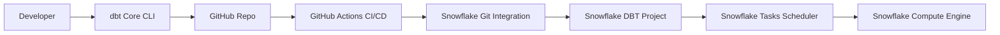

# 🌌 **Snowflake-Integrated DBT Core Implementation**

*A Production-Ready Architecture, CI/CD & POC Guide*

<p align="center">
  
</p>

<p align="center">
  
  
  
  
  
</p>

---

## 📘 **Table of Contents**

1. [Architecture Overview](#architecture-overview)
2. [Setup Instructions](#setup-instructions)

   * [Local DBT Core Setup](#local-dbt-core-setup)
   * [Snowflake Git Integration](#snowflake-git-integration)
   * [Scheduling with Snowflake Tasks](#scheduling-with-snowflake-tasks)
3. [Orchestration & Scheduling Comparison](#orchestration--scheduling-comparison)
4. [CI/CD & Version Control](#cicd--version-control)
5. [Team Collaboration & Scaling](#team-collaboration--scaling)
6. [Governance & Observability](#governance--observability)
7. [Performance & Cost](#performance--cost)
8. [Limitations](#limitations)
9. [POC Findings: What Works](#poc-findings-what-works)
10. [SlimCI Gap – Key Challenge](#slimci-gap--key-challenge)
11. [Critical Constraint: profilesyml](#critical-constraint-profilesyml)
12. [Final Recommendations](#final-recommendations)
13. [Conclusion](#conclusion)

---

# 1️⃣ **Architecture Overview**

### **Previous Architecture**

```
dbt Core (local)
      ↓
GitHub CI/CD
      ↓
dbt Cloud (orchestration)
      ↓
Snowflake
```

### **New Architecture (POC)**

```
dbt Core (local)
      ↓
GitHub CI/CD
      ↓
Snowflake DBT + Snowflake Tasks
      ↓
Snowflake Compute
```

### **Mermaid Architecture Flow**



---

# 2️⃣ **Setup Instructions**

## **Local DBT Core Setup**

```bash
# Install dbt core + snowflake adapter
pip install dbt-core dbt-snowflake

# Initialize dbt project
dbt init

# Execute models
dbt run
```

---

# **Snowflake Git Integration**

### 1. **Create GitHub Secret**

```sql
CREATE OR REPLACE SECRET my_git_secret
  TYPE = PASSWORD
  USERNAME = '<github-username>'
  PASSWORD = '<github-token>';
```

### 2. **Create API Integration**

```sql
CREATE OR REPLACE API INTEGRATION my_git_api
  API_PROVIDER = git_https_api
  API_ALLOWED_PREFIXES = ('<github repo url>')
  ALLOWED_AUTHENTICATION_SECRETS = (my_git_secret)
  ENABLED = TRUE;
```

### 3. **Register Git Repo in Snowflake**

```sql
CREATE OR REPLACE GIT REPOSITORY my_dbt_repo
  API_INTEGRATION = my_git_api
  GIT_CREDENTIALS = my_git_secret
  ORIGIN = '<github-repo-url>';
```

---

# **Scheduling with Snowflake Tasks**

### Task 1: Refresh Repository

```sql
CREATE OR REPLACE TASK RUN_SNOWFLAKE_DBT_REDEPLOY
  WAREHOUSE = COMPUTE_WH
  SCHEDULE = 'USING CRON 45 * * * * Asia/Kolkata'
AS
CALL REFRESH_DBT_PROJECT();
```

### Task 2: Execute DBT

```sql
CREATE OR REPLACE TASK RUN_DBT_PROJECT
  WAREHOUSE = COMPUTE_WH
  AFTER RUN_SNOWFLAKE_DBT_REDEPLOY
AS
EXECUTE DBT PROJECT SNOWFLAKE_DBT
  ARGS='run --vars "{TARGET_DB: PROD_DB, TARGET_SC: PUBLIC}"';
```

---

# 3️⃣ **Orchestration & Scheduling Comparison**

| Feature                 | dbt Cloud | Snowflake DBT         |
| ----------------------- | --------- | --------------------- |
| Merge-to-main execution | ✔         | ✔ via GitHub Actions  |
| PR SlimCI               | ✔         | ❌ Not possible        |
| Scheduled jobs          | ✔         | ✔ via Snowflake Tasks |
| Logs UI                 | ✔         | ❌ Limited             |

---

# 4️⃣ **CI/CD & Version Control**

### **dbt Cloud**

* Native PR jobs
* Automatic isolated schemas
* Less DevOps overhead

### **Snowflake DBT**

* Requires GitHub Actions
* No PR isolation
* No SlimCI equivalent

---

# 5️⃣ **Team Collaboration & Scaling**

| Area            | dbt Cloud | Snowflake DBT     |
| --------------- | --------- | ----------------- |
| Collaboration   | Strong    | Moderate          |
| Onboarding      | Easy      | Requires training |
| Dependency Mgmt | Automated | Manual            |
| Drift Risk      | Low       | Medium            |

---

# 6️⃣ **Governance & Observability**

### **dbt Cloud**

* Rich metadata
* Semantic layer
* Lineage UI
* APIs

### **Snowflake DBT**

* Inherits Snowflake RBAC
* Basic logs
* No UI for execution lineage

---

# 7️⃣ **Performance & Cost**

| Parameter    | dbt Cloud         | Snowflake DBT    |
| ------------ | ----------------- | ---------------- |
| Execution    | External          | Inside Snowflake |
| Latency      | Medium            | Low              |
| Compute cost | Cloud + Snowflake | Only Snowflake   |
| Performance  | Good              | Excellent        |

---

# 8️⃣ **Limitations**

| Area           | dbt Cloud     | Snowflake DBT |
| -------------- | ------------- | ------------- |
| File Limit     | Unlimited     | 20,000 files  |
| Repo Size      | GBs supported | 2GB max       |
| Semantic Layer | ✔             | ❌             |
| SlimCI         | ✔             | ❌             |

---

# 9️⃣ **POC Findings: What Works**

✔ dbt Docs
✔ Elementary
✔ Snapshots
✔ Macros & Seeds
✔ Incremental models
✔ Schema constraints

No degradation in functionality.

---

# 🔟 **SlimCI Gap – Key Challenge**

dbt Cloud SlimCI features:

* Creates `dbt_slimci_<hash>` schema
* Executes against production
* Runs tests
* Deletes schema

❌ Cannot replicate with GitHub Actions
❌ Cannot replicate with Snowflake Tasks
❌ No ephemeral schemas supported

---

# 1️⃣1️⃣ **Critical Constraint: `profiles.yml`**

### **Problem**

Snowflake DBT requires `profiles.yml` **inside project**, causing conflicts:

| Environment   | Problem             |
| ------------- | ------------------- |
| Local CLI     | Needs dev creds     |
| GitHub CI     | Needs staging creds |
| Snowflake DBT | Needs prod creds    |

### **Workarounds Tried**

* `.env.ps1` (local)
* GitHub env vars
* Snowflake DBT env vars

### ❌ Unresolved Issues

* profiles.yml loads **before** runtime
* Cannot inject dynamic credentials
* Hardcoding breaks CI/CD
* Local execution becomes cumbersome

---

# 1️⃣2️⃣ **Final Recommendations**

### ✔ Choose **dbt Cloud** if:

* Need SlimCI
* Need Semantic Layer
* Enterprise workflows
* Multiple developers
* Heavy CI/CD automation

### ✔ Choose **dbt on Snowflake** if:

* Prefer Snowflake-native execution
* Want lower latency
* Small/medium team
* Cost optimization

---

# 1️⃣3️⃣ **Conclusion**

Snowflake DBT is a strong alternative to dbt Cloud for teams wanting **simplicity, cost efficiency, and native execution inside Snowflake**.

However:

* SlimCI
* Dynamic environments
* profiles.yml conflicts

make dbt Cloud still superior for **enterprise-scale CI/CD**.

> **Summary**
> **Speed + Cost → Snowflake DBT**
> **Scalability + Automation → dbt Cloud**
